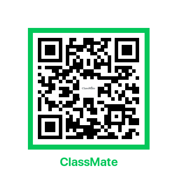
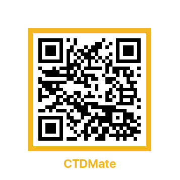

# 👋 안녕하세요, 김성환입니다

### 🎯 LLM 개발자 | AI 시스템 설계자

**8년간 하드웨어를 최적화하던 경험을, 이제 LLM 시스템 최적화로 확장합니다**

---

## 🚀 About Me

**LLM 개발자·시스템 설계자**로, Production급 AI 솔루션을 구축합니다.

- 🏢 **前 모터회사** 연구팀 선임연구원 (~2024.10)
  - Axial Flux 모터 연구 개발
  - Python 자동화로 설계 시간 **60% 단축**, 효율 **15% 향상**
- 🤖 **LLM 시스템 설계 & 최적화** 전문
  - 멀티 에이전트, RAG, GraphRAG, Fine-tuning
  - 비용 60% 절감, 속도 40% 향상 경험
- 🏆 **대회 입상 2회** + Meta 해커톤 참가
- 📄 **학생논문 게재 예정** (한국실천공학교육학회, 2025.12)
- 💚 **공익 프로젝트 진행중** - 청각장애인을 위한 GlassMate

> **핵심 역량**: LLM 시스템 아키텍처 설계 | 도메인 특화 Fine-tuning | 온디바이스 LLM | 비용 최적화

---

## 🛠️ Tech Stack

### AI/LLM

**Models & Techniques**
- OpenAI API & Local Models
- Fine-tuning (LoRA, QLoRA, 양자화)
- llama.cpp (온디바이스)
- RAG, GraphRAG, ReAct Pattern
- Function Calling, Intelligent Model Routing

### Backend & Database

**Query Languages**
- `Cypher` (GraphDB)
- `SQL` (Relational DB)

### Frontend & Tools

---

## 🏆 Awards & Recognition

| 수상 | 프로젝트 | 주관 | 내용 |
|------|---------|------|------|
| 🥇 **대상** | TrailMate | ICT 어워드 (한국정보처리학회) | 캠핑 추천 AI 챗봇 |
| 🥉 **동상** | ClassMate | 한국실천공학교육학회 | 영어 학습 멀티 에이전트 |
| 🚀 **참가** | CTDMate | Meta 해커톤 | 의약품 인허가 문서 자동화 |
| 📄 **논문** | ClassMate | 한국실천공학교육학회 | 학생논문 게재 예정 (2025.12) |

---

## 📌 Featured Projects

<table>
<tr>
<td width="50%">

### 🏆 ClassMate
**AI 교육 플랫폼** (동상 🥉 + 논문 📄)

**3-Way 멀티 페르소나** 영어 학습 시스템
- 👨‍🎓 학생 / 👪 학부모 / 👨‍🏫 교사 각 AI 어시스턴트
- **29개 Function Tools** 구현
- OCR 파싱 + DB 자동 적재
- Intelligent Model Routing
- **비용 60% 절감, 속도 40% 향상**

**Tech**: GPT-4o/o4-mini, ReAct, GraphRAG, Neo4j

</td>
<td width="50%">

### 🏆 TrailMate
**캠핑 추천 챗봇** (대상 🥇)

자연어 기반 캠핑장 추천 AI
- **캠핑 도메인 Fine-tuning**
- LangChain/LangGraph 대화 흐름
- Neo4j GraphDB + RAG
- 실시간 경로 시각화 (Tmap API)
- 반응형 UI

**Tech**: LangGraph, Neo4j, Flask, Fine-tuning

</td>
</tr>
<tr>
<td width="50%">

### 🚀 CTDMate
**의약품 인허가 문서 자동화** (Meta 해커톤)

규칙 + RAG 하이브리드 시스템
- **온디바이스 LLM** (llama.cpp + LoRA)
- **의약품 규제 도메인 Fine-tuning**
- OCR 파싱 (Upstage Document Parse)
- ICH/MFDS 가이드라인 검증
- 인용형 검색 & 근거 하이라이트

**Tech**: llama.cpp, LoRA, Upstage Parse

</td>
<td width="50%">

### 💚 GlassMate
**청각장애인 AI 대화 보조** (진행중)

**공익 프로젝트** (비영리, 오픈소스)
- 실시간 STT (Whisper Large v3)
- AI 답변 제안 (Gemma-2B SLM)
- 완전 로컬 처리 (프라이버시 보호)
- AR 글래스 (METALENSE 2)
- Unity 클라이언트 개발중

**Tech**: Whisper, Gemma, llama.cpp, Unity, AR

</td>
</tr>
</table>

---

## 💡 Key Achievements

### 🎯 LLM 시스템 최적화
- **비용 절감**: Intelligent Model Routing으로 **60% 절감** (ClassMate)
- **속도 향상**: 응답 시간 **40% 개선** (ClassMate)
- **검색 정확도**: GraphRAG로 **92% 정확도** 달성

### 🎓 도메인 특화 Fine-tuning
- **캠핑 도메인** - 한국 캠핑 용어 및 추천 로직
- **의약품 규제** - ICH/MFDS 가이드라인 전문
- **교육 도메인** - 영어 학습 맞춤형

### 🤖 멀티 에이전트 시스템
- **29개 Function Tools** 통합 (ClassMate)
- **3-Way 페르소나** 시스템 설계
- ReAct 패턴으로 복잡한 다단계 질문 처리

### 🔒 온디바이스 LLM
- llama.cpp 기반 로컬 처리
- LoRA Fine-tuning 최적화
- 프라이버시 보호 & 규제 준수

---

## 📊 GitHub Stats

---

## 🌱 Currently Working On

- 💚 **GlassMate** - 청각장애인을 위한 공익 프로젝트 (Phase 1 진행중)
- 📚 **학습** - 최신 LLM 기술 및 최적화 기법 연구
- 📄 **논문** - ClassMate 학생논문 게재 (2025.12)
- 🎯 **포트폴리오** - CTDMate 전용 포트폴리오 제작

---

## 📫 Contact

**협업, 기술 논의, 채용 문의 환영합니다!**

---

### 💭 Philosophy

> "8년간 하드웨어를 최적화하던 그 사고방식으로,  
> 이제는 LLM 시스템을 최적화합니다.  
> 본질은 동일합니다."

**기술은 모두를 위한 것입니다** 🤟

---

## 📱 프로젝트 포트폴리오 & 데모

**📱 스마트폰 카메라로 QR 코드를 스캔하세요!**

<table>
<tr>
<th width="33%" align="center">🏆 ClassMate</th>
<th width="33%" align="center">🏆 TrailMate</th>
<th width="33%" align="center">🚀 CTDMate</th>
</tr>

<tr>
<td align="center">

 
<b>📄 포트폴리오</b>
 
3-Way 멀티 에이전트
</td>
<td align="center">

 
<b>📄 포트폴리오</b>
 
캠핑 추천 AI
</td>
<td align="center">

 
<b>📄 포트폴리오</b>
 
의약품 인허가 자동화
</td>
</tr>

<tr>
<td align="center">

 
<b>🎬 데모 영상</b>
 
시스템 시연
</td>
<td align="center">

 
<b>🎬 데모 영상</b>
 
GraphRAG 검색
</td>
<td align="center">

 
<b>🎬 데모 영상</b>
 
온디바이스 LLM
</td>
</tr>
</table>

---
